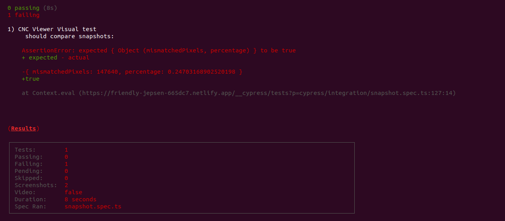

Here you can find an option to solve [the offered task](task.md).

___

:round_pushpin: The following tools were selected:
- [Cypress](https://www.cypress.io/) (bundled in Mocha, Chai);
- [cypress-visual-regression](https://github.com/mjhea0/cypress-visual-regression);
- [Applitools Eyes](https://applitools.com/products-eyes/);
- [faker.js](https://github.com/marak/Faker.js/).

Main language: **TypeScript**

**Cypress** was chosen cause:
- allows intercepting XHR requests that was one item needed to be done;
- works faster than Selenium based tools;
- has access to page DOM.

Prepared two options for visual testing: 
1. **cypress-visual-regression** is a plugin that already integrated with Cypress for performing snapshot comparisons.
2. **Applitools** allows performing visual testing for particular page section instead of the full page screen.
Also, you can set up different distinct match levels.
Like we have the small image section in the offered example that changes pictures for every page load, i.e. dynamic content.
You can configure it not to consider this section and validate the page layout consistency w/o this part.
Plus, it offers pretty good GUI with test reports and ability to easy reject / apply changes in your layout.

**faker.js** is a lib that helps you to create random data for your tests and don't waste time to write your own helpers methods instead of focusing on more important stuff.

---

:open_file_folder: Regarding the *test project structure*, it is divided into the common Cypress structure:
- `fixtures/` - test data, such as billing address and payment method info. Also, there are card types, counties and states enums;
- `integration/` - spec files themselves;
- `support/` - Page Objects, models, extensions of cypress chainable and helper methods;
- `snapshots/base` - we can find our [Baseline img](cypress/snapshots/base/snapshot.spec.ts/Baseline-base.png).

Selectors and logic of main actions on the page are in Page Objects.
In specs, you already can use pages API to perform actions according to test case steps and asserts.

---

#### :round_pushpin: To run tests, need to do the next:
```
    # Install packages
    npm ci

    # Run Cypress Test Runner (GUI mode)
    npm run cy:open
    
    # Run all specs in headless mode
    npm run cy:run 

    # Run only snapshot spec
    npm run cy:snapshot:run

    # Run only Applitools comparing
    npm run cy:applitools:run
```
___

:round_pushpin: The following test cases aren't coded, but from my perspective they should be covered:
- increasing/decreasing item count in the cart;
- adding a few different items to the card;
- checking subtotal on UI and in XHR response body;
- checking billing address and payment info on the already paid order summary.

----

### :round_pushpin: Visual regression results:

:arrow_forward: using **cypress-visual-regression**

In case of 0.2 threshold, average value of mismatched is 23%.

| Threshold | Actual |
| --- | --- |
| 0.2 | 0.23919993262237527 |
| 0.2 | 0.2130325110533637 |
| 0.2 | 0.23456110086248333 |
| 0.2 | 0.2419437890783604 |



:arrow_forward: example of **Applitools** test report:


